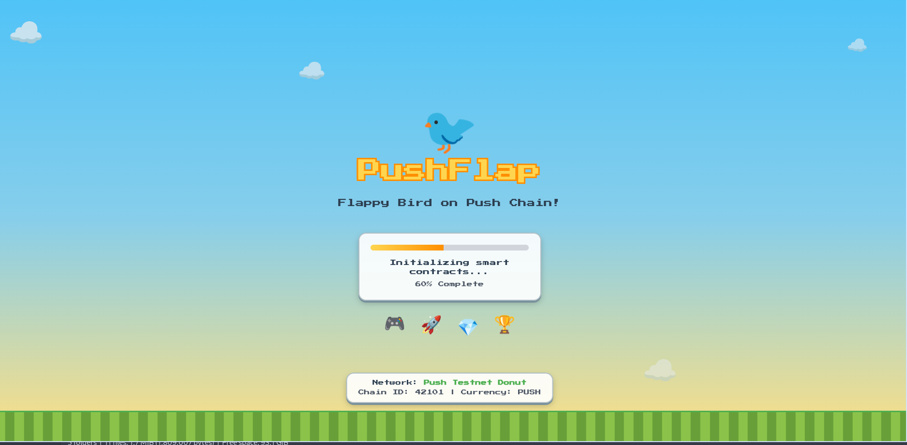
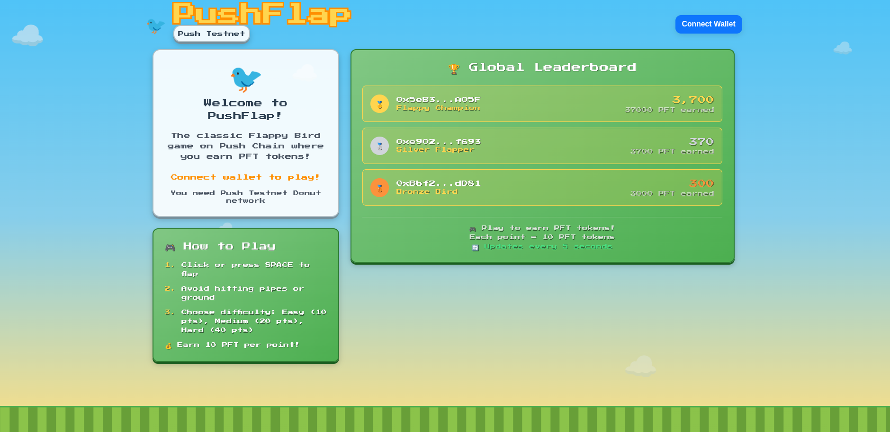
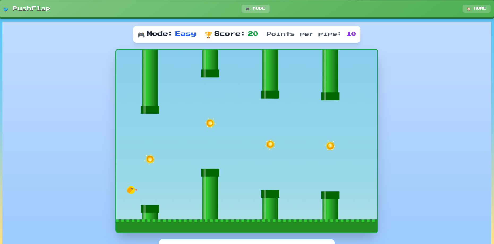

# PushFlap Game

This is a web-based game built with React and Vite, integrated with blockchain functionalities using Wagmi and RainbowKit. It's a web3 take on the classic Flappy Bird game.

**Live URL:** [https://pushflapgamee.vercel.app/](https://pushflapgamee.vercel.app/)

**GitHub Repository:** [https://github.com/MrTimonM/PushFlap-Game](https://github.com/MrTimonM/PushFlap-Game)

## Description

PushFlap Game is an interactive application that demonstrates the use of modern web technologies for creating decentralized applications (dApps). It allows users to connect their Ethereum wallets and interact with smart contracts.

To play the game, you will need `$PUSH` Testnet tokens. You can get them from the faucet: [https://faucet.push.org/](https://faucet.push.org/)

## Gameplay

Here are some screenshots of the gameplay:





## Getting Started

These instructions will get you a copy of the project up and running on your local machine for development and testing purposes.

### Prerequisites

You need to have Node.js and npm (or yarn) installed on your machine.

- [Node.js](https://nodejs.org/)
- [npm](https://www.npmjs.com/get-npm) or [yarn](https://classic.yarnpkg.com/en/docs/install/)

### Installation

1.  Clone the repo
    ```sh
    git clone https://github.com/MrTimonM/PushFlap-Game.git
    ```
2.  Install NPM packages
    ```sh
    npm install
    ```
3.  Start the development server
    ```sh
    npm run dev
    ```

The application will be available at `http://localhost:5173` (or another port if 5173 is busy).

## Customization

Users can change game settings like gravity, pipe size, space, and speed from the `src/config/gameSettings.js` file.

## Roadmap

📅 **Roadmap:**
-   [x] Plan & execute
-   [x] Deploy base version
-   [x] Add difficulty mode
-   [x] Add reward system
-   [x] Upload code to GitHub
-   [ ] Add sounds
-   [ ] Make responsive for mobile
-   [ ] Add NFT support
-   [ ] Add more themes
-   [ ] Add in-game chat system
-   And more...

## Available Scripts

In the project directory, you can run:

-   `npm run dev`: Runs the app in the development mode.
-   `npm run build`: Builds the app for production to the `dist` folder.
-   `npm run lint`: Lints the project files using ESLint.
-   `npm run preview`: Serves the production build locally.
-   `npm run check-rpc`: Custom script to check RPC connections.
-   `npm run quick-rpc`: Custom script for a quick RPC check.

## Pushchain Testnet Details

To interact with the game on the Push Testnet, you'll need to add the following network configuration to your wallet:

-   **Network name:** Push Testnet Donut
-   **New RPC URL:** https://evm.rpc-testnet-donut-node1.push.org
-   **Chain ID:** 42101
-   **Currency symbol:** PUSH
-   **Block explorer URL:** https://donut.push.network/

## Technologies Used

-   **Frontend:**
    -   [React](https://reactjs.org/)
    -   [Vite](https://vitejs.dev/)
    -   [Tailwind CSS](https://tailwindcss.com/)
-   **Blockchain:**
    -   [Wagmi](https://wagmi.sh/)
    -   [RainbowKit](https://www.rainbowkit.com/)
    -   [Ethers.js](https://docs.ethers.io/)
    -   [Viem](https://viem.sh/)

## Contributing

Feel free to fork this repository and submit pull requests to improve it.

## License

This project is licensed under the MIT License - see the LICENSE.md file for details.
